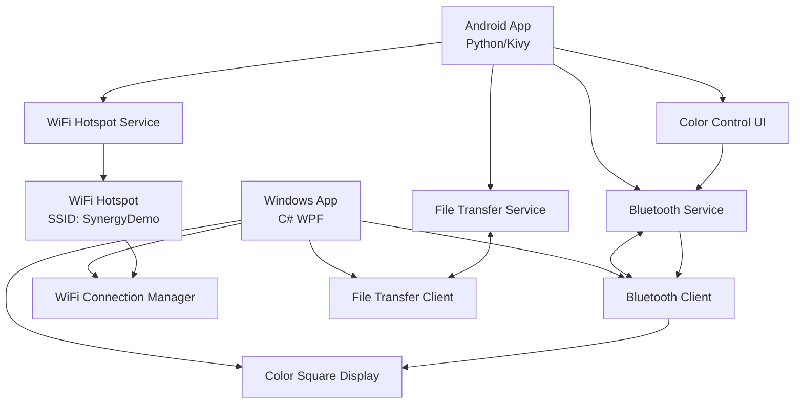

# Cross-Platform Communication System Architecture

## Overview
A demonstration system featuring an Android application (Python/Kivy) and Windows application (C# WPF) that communicate via Bluetooth and transfer files over Wi-Fi.

## System Architecture



## Communication Flow

### 1. Initial Setup Phase
1. **Bluetooth Pairing**
   - Windows app scans for Bluetooth devices
   - User selects Android device from list
   - Standard Bluetooth pairing process
   - Connection established via Bluetooth Classic (RFCOMM)

2. **Wi-Fi Hotspot Creation**
   - Android app creates Wi-Fi hotspot with predefined SSID: "SynergyDemo"
   - Password: "synergy123" (configurable)
   - Android sends hotspot details via Bluetooth to Windows

3. **Wi-Fi Connection**
   - Windows app receives hotspot credentials
   - Automatically connects to Android's Wi-Fi hotspot
   - TCP socket connection established for file transfers

### 2. Operational Phase
1. **Color Control Commands**
   - Android app sends color commands ("RED", "YELLOW", "GREEN") via Bluetooth
   - Windows app receives commands and updates square color in GUI

2. **File Transfer Operations**
   - Either side can initiate file transfer request
   - Request sent via Bluetooth with file size specification
   - Random file generated on sender side
   - File transferred via Wi-Fi (TCP) with progress tracking
   - Transfer statistics displayed (time, bit rate)

## Technical Specifications

### Android Application (Python/Kivy)
- **Framework**: Kivy + KivyMD for Material Design
- **Bluetooth**: PyJNIus for Android Bluetooth API access
- **WiFi Hotspot**: Android WifiManager via PyJNIus
- **File Operations**: Python file I/O with random content generation
- **Build Tool**: Buildozer for APK generation

### Windows Application (C# WPF)
- **Framework**: .NET WPF for native Windows experience
- **Bluetooth**: Windows.Devices.Bluetooth APIs
- **WiFi**: Windows.Devices.WiFi APIs or WlanApi
- **Networking**: System.Net.Sockets for TCP file transfers
- **UI Framework**: WPF with MVVM pattern

### Communication Protocols

#### Bluetooth Messages (JSON Format)
```json
{
  "type": "command|response|file_request",
  "action": "color_change|wifi_info|file_transfer",
  "data": {
    "color": "RED|YELLOW|GREEN",
    "ssid": "SynergyDemo",
    "password": "synergy123",
    "file_size": 50000000
  },
  "timestamp": "ISO8601"
}
```

#### File Transfer Protocol (TCP)
1. Handshake: File size and metadata
2. Data transfer: Chunked transfer with progress updates
3. Verification: Checksum validation
4. Completion: Transfer statistics

## File Structure

### Android Application
```
SynergyClient/
├── main.py                    # Main Kivy app
├── bluetooth_service.py       # Bluetooth communication
├── wifi_hotspot_service.py    # WiFi hotspot management
├── file_transfer_service.py   # File generation and transfer
├── gui/
│   ├── main_screen.kv         # Main UI layout
│   └── color_control.kv       # Color control interface
├── utils/
│   ├── protocol.py            # Message protocol definitions
│   └── file_generator.py      # Random file generation
├── requirements.txt
└── buildozer.spec
```

### Windows Application
```
SynergyWindows/
├── SynergyWindows.sln
├── SynergyWindows/
│   ├── MainWindow.xaml        # Main UI
│   ├── MainWindow.xaml.cs     # Main window logic
│   ├── ViewModels/
│   │   └── MainViewModel.cs   # MVVM view model
│   ├── Services/
│   │   ├── BluetoothService.cs
│   │   ├── WiFiService.cs
│   │   └── FileTransferService.cs
│   ├── Models/
│   │   ├── Message.cs         # Protocol message classes
│   │   └── TransferProgress.cs
│   └── Utils/
│       ├── FileGenerator.cs
│       └── NetworkUtils.cs
```

## Security Considerations
- Bluetooth pairing provides authentication
- Wi-Fi hotspot uses WPA2 encryption
- File transfers include checksum verification
- No persistent storage of sensitive data

## Performance Targets
- Bluetooth message latency: < 100ms
- File transfer rates: 5-50 Mbps (typical Wi-Fi hotspot speeds)
- File size range: 10MB - 100MB
- Transfer progress updates: Every 1% or 1MB

## Error Handling
- Connection timeout handling
- Network disconnection recovery
- File transfer resumption (optional)
- User-friendly error messages
- Comprehensive logging for debugging

## Testing Strategy
1. **Unit Testing**: Individual service components
2. **Integration Testing**: Cross-platform communication
3. **Performance Testing**: File transfer benchmarks
4. **User Acceptance Testing**: End-to-end scenarios
5. **Edge Case Testing**: Network failures, large files

## Deployment Requirements

### Android
- Android 5.0+ (API 21+)
- Bluetooth and Wi-Fi capabilities
- Storage permissions for file operations

### Windows
- Windows 10/11
- .NET 6.0 or later
- Bluetooth and Wi-Fi adapters
- Administrator privileges for Wi-Fi management

## Future Enhancements
- Multiple file transfer queuing
- Encryption for file transfers
- Cross-platform file synchronization
- Network discovery improvements
- Enhanced UI/UX features